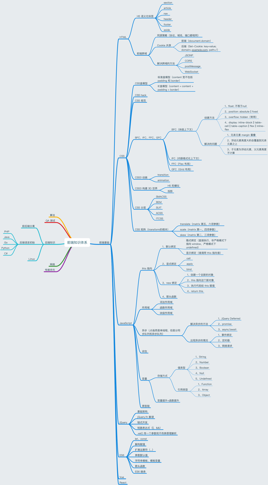

# 前端学习思维导图

## 概况

主要记录自己努力成为大前端的历程，其中包括了前端需要掌握的很多知识点。写这个就是为了见证自己努力成行的过程，通过思维导图去引导自己该学什么东西，怎么去学，让自己努力变强大，让自己成长更快。

## 内容

主要总结以下几块内容

- 前端基础知识

- 前端框架学习

- 后端知识了解

- 前端测试

- 网络知识

- 前端性能优化方面

## 思维导图

自己总结的前端知识体系

通过学习不断的去更新思维导图及学习笔记。