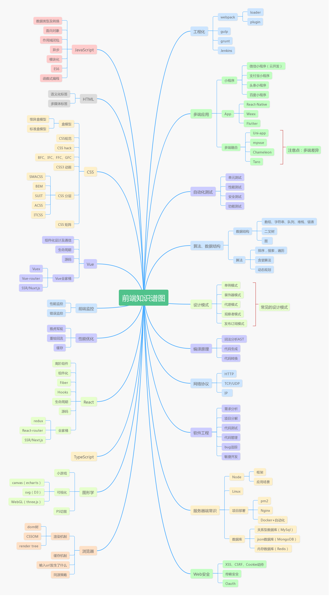

# 大前端学习笔记

## 概况

主要记录自己努力成为大前端的历程，其中包括了前端需要掌握的很多知识点。写这个就是为了见证自己努力成长的过程，主要通过思维导图去引导自己该学什么东西，然后通过学习的笔记和遇到的问题去进行系统的学习。

努力让自己变强大，让自己成长更快。

## 笔记主要内容

主要总结以下几块内容

- 前端基础知识

基础知识包括，js 深入理解，css，html，TypeScript，前端性能优化，前端自动化测试，多端应用，工程化概念，前端监控...

- 前端框架学习

框架主要包括 Vue，React，jQuery。

- 后端知识

后端包括 Node，Linux，Nginx，php...

- 网络知识

网络主要是HTTP，TCP、IP。

- 计算机基础知识

算法，数据结构，软件工程，编译原理，设计模式...

## 知识图谱

在学习的过程中，不断完善前端知识图谱，下面这个是知识体系概况思维导图，每个模块在学习的时候，会有模块详细的思维导图。

通过不断学习去强大自己，一定要为大前端的目标不断进步，每天进步一点。

引用蜗牛老湿的一幅图，前端等级对应着王者等级，鼓励自己努力成长。

如果自己连学习的动力也没有，那么这一生注定是一个平庸的人。加油。
