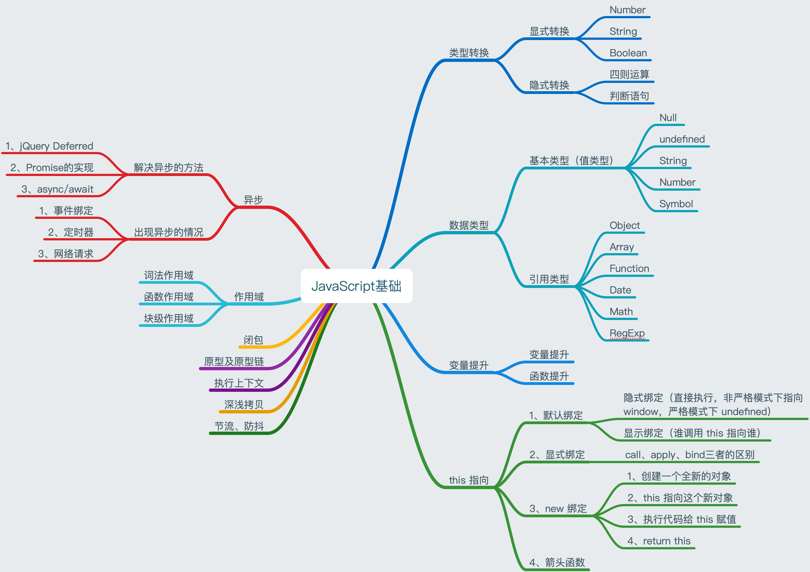

# 你不知道的 JavaScript

[[toc]]



## 1. 数据类型

### 1.1 数据类型概述

基本类型：`Undefined`，`Null`，`Boolean`，`String`，`Number`

引用类型：`Object`，`Array`，`Date`，`Function`，`RegExp`

js 中不管定义什么类型的数据都是使用`var`或`let`或`const`，不像其他语言，可以直接定义变量的类型，所以 js 中一般都会根据定义变量的值去区分具体的数据类型。

我们在想判断变量类型时，可以使用`typeof`来判断数据类型，但是判断出来的类型有的时候不尽如人意。

```js
console.log(typeof undefined); //undefined
console.log(typeof 123); //number
console.log(typeof '123'); //string
console.log(typeof true); //boolean
console.log(typeof [1, 2, 3]); //object
console.log(typeof { id: 11 }); //object
console.log(typeof null); //object
console.log(typeof console.log); //function
```

因为`typeof`在判断对象时的结果不尽如人意，所以我们可以使用`Object.prototype.toString`获取一个对象的类型。

```js
var toString = Object.prototype.toString;

toString.call(new Date()); // [object Date]
toString.call(new String()); // [object String]
toString.call(Math); // [object Math]
toString.call(/s/); // [object RegExp]
toString.call([]); // [object Array]

//Since JavaScript 1.8.5
toString.call(undefined); // [object Undefined]
toString.call(null); // [object Null]
```

还有一个判断类型的操作符`instanceof`，这个还有待继续研究。

### 1.2 类型转换

js 中的数据类型可以进行转换，转换的方式也有很多，但是大体上主要是分为显式转换和隐式转换。

#### 1.2.1 显式转换

- Number 函数

  1. 数字：转换后还是数字
  2. 字符串：如果可以被解析为数值，则为相应的数值，如果不能，则是 NaN，如果是空字符串那就是 0
  3. 布尔值：true 为 1，false 为 0
  4. undefined：NaN
  5. null：0
  6. object：先执行 object 原型上的`valueOf`方法，看是否能转换，如果不可以再执行原型链上的`toString`，看是否可以转换，如果不可以报错

- String 函数

  1. 数字：转换成对应的字符串
  2. 字符串：还是对应的字符串
  3. 布尔值：true 为'true'，false 为'false'
  4. undefined：undefined
  5. null：null
  6. Object：先执行`toString`方法，看是否能转换，如果不可以再执行`valueOf`，看是否可以转换，如果不可以报错

- Boolean
  `NaN`，`null`，`undefined`，`0`，`""`，`false`都会转换成 false，其他的都会被转换成 true。

#### 1.2.2 隐式转换

在使用 **四则运算** 和 **判断语句** 时都会进行隐式转换，正常的都转换我们基本都会，但是有些转换会比较奇葩。

**如：**


### 1.3 对象

ES5 中本身给对象添加了很多 api，有些是我们开发中常用的，有些是我们很少用到的。

一些开发中常用到的 api，比如：

- `for...in`
- `hasOwnProperty`：检查属性是不是对象自有的，排除从原型链找到的属性

**例：**

```js
var obj = {
  x: 10,
  y: 20,
  z: 30
};

for (var key in obj) {
  if (obj.hasOwnProperty(key)) {
    console.log(key + ':' + obj[key]);
  }
}
```

- `Object.keys()`：获取对象的 key 值

还有一些不常用的，比如：

- `Object.create()`：创建一个`__proto__`等于现有对象的新对象。
- `Object.freeze()`：冻结对象。
- `Object.defineProperty()`：创建一个对象，其中可以定义对象是否可配置，是否可枚举，对象`set`，`get`方法。

### 1.4 Math

- `Math.random()` - 返回 0 ~ 1 之间的随机数
- `Math.abs(x)` - 返回数的绝对值
- `Math.ceil(x)` - 向上取整
- `Math.floor(x)` - 向下取整

### 1.5 Date

```javascript
console.log(Date.now()); // 获取当前毫秒数
var dt = new Date(); // 获取当前时间
console.log(dt.getTime()); // 当前时间的毫秒数
console.log(dt.getFullYear()); //  年
console.log(dt.getMonth() + 1); // 月（0-11）
console.log(dt.getDate()); // 日（0-31）
console.log(dt.getHours()); // 时（0-23）
console.log(dt.getMinutes()); // 分（0-59）
console.log(dt.getSeconds()); // 秒（0-59）
```

### 1.6 数组

数组的原型链上其实包含了很多我们经常使用的方法，比如下面这几个简单的例子：

- forEach（遍历所有元素）

```js
var arr = ['a', 'b', 'c', 'd'];
arr.forEach(function(item, index) {
  console.log(item + ',' + index);
});
```

- map（对数组进行重新组装，生成新的数组）

```js
// map，生成新数组，不改变原来数组的格式
var arr = ['a', 'b', 'c', 'd'];
var result = arr.map(function(item, index) {
  return index + '/' + item;
});
console.log(result);
```

- sort（对数组进行排序）

```js
// sort， 会改变原来数组
var arr = [1, 23, 3, 4];
var result = arr.sort(function(a, b) {
  // 从小到大排序
  return a - b;

  // 从大到小排序
  // return b - a;
});
console.log(result);
```

- filter（过滤符合条件的元素）

```js
var arr = [1, 2, 3, 4];
var result = arr.filter(function(item, index) {
  if (item < 3) {
    return true;
  }
});
console.log(result);
```

- every（判断所有元素是否都符合要求）

```js
var arr = [1, 2, 3, 4];
var result = arr.every(function(item, index) {
  if (item < 3) {
    return true;
  }
});
console.log(result); // false
```

- some（判断是否有至少一个元素符合条件）

```js
var arr = [1, 2, 3, 4];
var result = arr.some(function(item, index) {
  if (item < 3) {
    return true;
  }
});
console.log(result); // true
```

- join（根据条件对数组组合成字符串）

```js
var arr = [1, 2, 3, 4];
var result = arr.join(',');
console.log(result);
```

- reverse（将数组反转）

```js
var arr = [1, 2, 3, 4];
var result = arr.reverse();
console.log(result);
```

在 ES6 中其实也添加了很多数组的方法，比如`Array.form`，这里暂时不列举，具体 ES6 新增数组的方法，应该去找阮一峰大神的 ES6 教程里去查看。

## 2. 参数传递

### 2.1 按值传递

基本类型都是按值传递，新创建的变量和老变量有关联，但是在创建新变量时会新开辟一个内存空间，即使修改新变量，也不会对老变量有影响。

例：

```js
function test(num) {
  num = num + 1;
  console.log('num2:', num); // num2: 2
}

var num = 1;
test(num);
console.log('num1:', num); // num1: 1
```

按值传递的类型有：String，Number，Boolean

### 2.2 按引用传递

如果新创建的对象引用了老对象，再给新对象添加属性时，会将老对象也一并修改。因为引用的地址不会发生变化，不会新开辟一个内存空间。

如果新创建的对象后续等于了`{}`，那么修改就不会影响老对象。

例：

```js
function test(obj) {
  obj.age = 18;
  console.log('新创建的对象', obj); // {name: "test", age: 18}
}

var obj = {
  name: 'test'
};
console.log('旧对象', obj); // {name: "test"}
test(obj);
console.log('被修改的旧对象', obj); // {name: "test", age: 18}
```

按引用传递的类型有：Object，Array

## 3. 作用域及闭包

JS 中的三座大山其中一座，作用域和闭包，作用域和闭包的知识在前端面试中，很容易被问到，也很容易掉坑，其实作用域中不好分辨的主要是 this 指向，函数变量提升的内容。

### 3.1 this 指向问题（待完善）

#### 3.1.1 默认绑定

说白了就是谁调用绑定谁。但是其中还有两种绑定方式，隐式绑定和显式绑定。

具体隐式绑定和显式绑定，用下面两个例子来详细的说明一下。

- 隐式绑定

隐式绑定的意思就是没有调用对象，如果在非严格模式下，就指向`window`，如果在严格模式下，就是报错`Cannot read property xx of undefined`。

在非严格模式下的例子：

例：

```js
var name = '我是window的名字';

var obj = {
  name: '我是对象obj的名字',
  test: function() {
    console.log(this.name);
  }
};

var alertName = obj.test;
alertName(); // 输出：我是window的名字，隐式绑定
```

在调用`alertName`时因为没有调用对象，并且是在非严格模式下，所以会输出`window`的`name`。如果是在严格模式下就会报错`Cannot read property 'name' of undefined`。

严格模式下的例子：

```js
'use strict';
var name = '我是window的名字';

var obj = {
  name: '我是对象obj的名字',
  test: function() {
    console.log(this.name);
  }
};

var alertName = obj.test;
alertName(); // Cannot read property 'name' of undefined
```

- 显式绑定

显式绑定的意思就是有固定的对象去调用方法。这个在严格模式下和非严格模式下是没有区别的。

例：

```js
var obj = {
  name: '我是对象obj的名字',
  test: function() {
    console.log(this.name);
  }
};

obj.test(); // 我是对象obj的名字
```

调用`test`方法的对象是`obj`，所以`this`指向`obj`，自然就会输出`obj`的`name`了。

#### 3.1.2 显式绑定

call，apply，bind

#### 3.1.3 new 绑定

使用 new 操作符生成一个对象主要包含以下四个过程：

1. 创建一个新对象
2. this 指向这个新对象
3. 执行代码给 this 赋值
4. return this

**例：**

```js
function Foo(name) {
  this.name = name;
  // return this;  // 本身会执行这一步
}

var f = new Foo('syp');
console.log(f.name); // 输出：syp
```

#### 3.1.4 箭头函数

### 3.2 作用域

JS 属于函数作用域，只要在函数内部定义的变量，在函数内部一定能访问。

在 ES6 之前没有块级作用域，在 ES6 之后存在了块级作用域，使用`let`，`const`定义的变量或者对象，都会存在块级作用域。

例：

```js
function test() {
  if (false) {
    var i = 100;
  }
  console.log(i); // undefined
  console.log(j); // Uncaught ReferenceError: j is not defined
}
test();
```

虽然是在判断条件中定义的变量，并且当前条件也不满足，但是在访问定义的变量时，会提示`undefined`，而不是`Uncaught ReferenceError: j is not defined`报错，充分说明了在判断条件中定义的变量，即时没有执行到判断条件中，变量也会提前声明。

在函数内部可以访问内部和外部的变量，但是函数外部不能访问内部的变量，只能访问外部的变量。

例：

```js
var m = 1000;

function test() {
  if (false) {
    var i = 100;
  }
  console.log(m); // 1000
  console.log(i); // undefined
}

test();

console.log(i); // Uncaught ReferenceError: i is not defined
```

### 3.3 变量提升和函数提升

#### 3.3.1 变量提升

变量在任何地方定义的时候都会发生变量提升。

例：

```js
console.log(a); // undefined

var a = 2;
```

在定义`a`之前打印`a`，并不会报`Uncaught ReferenceError: i is not defined`的错，而是输出`undefined`，因为`var a = 2`会进行变量提升，会被引擎解析成如下代码：

```js
var a;

console.log(a); // undefined

a = 2;
```

首先会声明`var a`，所以在使用的时候会输出`undefined`。引擎对变量声明进行了变量提升。

`var a = 2`，javascript 引擎其实会分解成`var a`和`a = 2`两个单独的声明，第一个是编译阶段，第二个是执行阶段。

#### 3.3.2 函数提升

函数声明和变量声明一样，在被执行前都会进行“移动”处理，“移动”到**各自作用域的最顶端**，也就是所谓的提升。

在定义函数之前使用函数，函数也会执行。

例：

```js
test();

function test() {
  var i = 1;
  console.log(i); // 1
}
```

虽然函数和变量都会提升，但是**函数提升优于变量提升**。

例：

```js
foo(); // 1

function foo() {
  console.log(1);
}

var foo = function() {
  console.log(2);
};
```

会先输出 1 而不是 2，因为引擎会解析成一下代码：

```js
function foo() {
  console.log(1);
}

var foo; // 被忽略了

foo(); // 1

foo = function() {
  console.log(2);
};
```

`var foo` 是重复声明，所以被忽略了，因为函数声明优于变量声明。

### 3.4 闭包

简单粗暴的来讲，就是拿到了本不该属于自己的东西。

例：

```js
function test() {
  var k = 1000;
  return function() {
    return k;
  };
}

var newK = test()();

console.log(newK);
```

科学的来讲，其实就是，函数可以记住并访问所在的词法作用域时，不论函数在哪儿执行，都会产生闭包。

上面的例子中 test 函数 return 出来了一个 function，return 出来的 function 能够记住自己所在的函数作用域，并且能够访问自己所在函数作用域中的变量，这样其实就形成了闭包。

其实在 JS 开发中处处都会用到闭包，只不过我们没有仔细去发现。

闭包在开发中可以用来实现模块，模块的两个主要特征：

- 为了创建内部作用域而调用一个包装函数
- 包装函数返回值必须至少包括一个对内部函数的引用

## 4. 异步和单线程（待完善）

js 属于单线程的语言，CPU 只能同一时间处理一个事务，如果遇到阻塞的代码，就会停止运行，比如`alert`。所以 js 中就出现了异步的情况，异步的代码不是在代码定义的位置就一定要执行完，js 在碰到异步的代码时，会将异步的代码放到异步队列中，等待所有代码都执行完之后，在一次执行异步队列中的代码。

一般需要等待的任务都是异步任务，比如：

1. 定时任务：setTimeout，setInterval
2. 网络请求：ajax 请求，动态 img 加载
3. 事件绑定

## 5. 原型与原型链（待完善）

原型和原型链也是 js 中的三座大山之一，也算其中最难跨过的一座，其他两座大山，异步和作用域理解起来并没有原型链这么复杂，因为想要深入了解原型，可以去研究 zepto 或者 jquery

### 4.1 原型的五条规则

1. 所有的引用类型都可以自定义添加属性
2. 所有的引用类型都有自己的隐式原型（**proto**）
3. 函数都有自己的显式原型（prototype）
4. 所有的引用类型的隐式原型都指向对应构造函数的显示原型
5. 使用引用类型的某个自定义属性时，如果没有这个属性，会去该引用类型的**proto**（也就是对应构造函数的 prototype）中去找

### 4.2 原型链继承

正确的继承要做到以下几点：

1. 拿到父类原型链上的方法
2. 不能让构造函数执行 2 次
3. 引用的原型链不能是按地址传递
4. 修正子类的 constructor

## 6. 严格模式

特点：

- 未定义的变量不会默认定义成全局变量

- 重复的对象字面量禁止重复定义

- this 的值为 null 或者 undefined 时，不会分配给 window

- 禁止使用`delete`删除变量或者函数

- 不能使用保留关键字（public 等）

- 无法在语句或者块中声明函数

  例：在`for`循环中声明`function`

- 同一个函数定义重复的形参

- 不能使用`eval`，`arguments`定义变量，函数

- 不要修改`arguments`

- 不能使用`with`

- 不能使用`arguments.callee`

## 7. JSON 对象

JSON 对象提供了`JSON.stringify`和`JSON.parse`两个方法。`JSON.stringify`可以将 JSON 对象格式化成 JSON 字符串，`JSON.parse`可以将 JSON 字符串格式化成 JSON 对象。

- JSON.stringify

第一个参数具体格式化的对象，第二个参数可以写一个函数，对 JSON 对象的值进行操作，第三个参数可以规定格式化之后空格的格数。

例：

```js
var name = {
  first: 1,
  second: 2,
  third: 3
};

var luckyName = JSON.stringify(
  name,
  function(key, value) {
    if (value == 3) {
      return undefined;
    } else {
      return value;
    }
  },
  0
);

console.log(luckyName); // {first: 1, second: 2}
```
