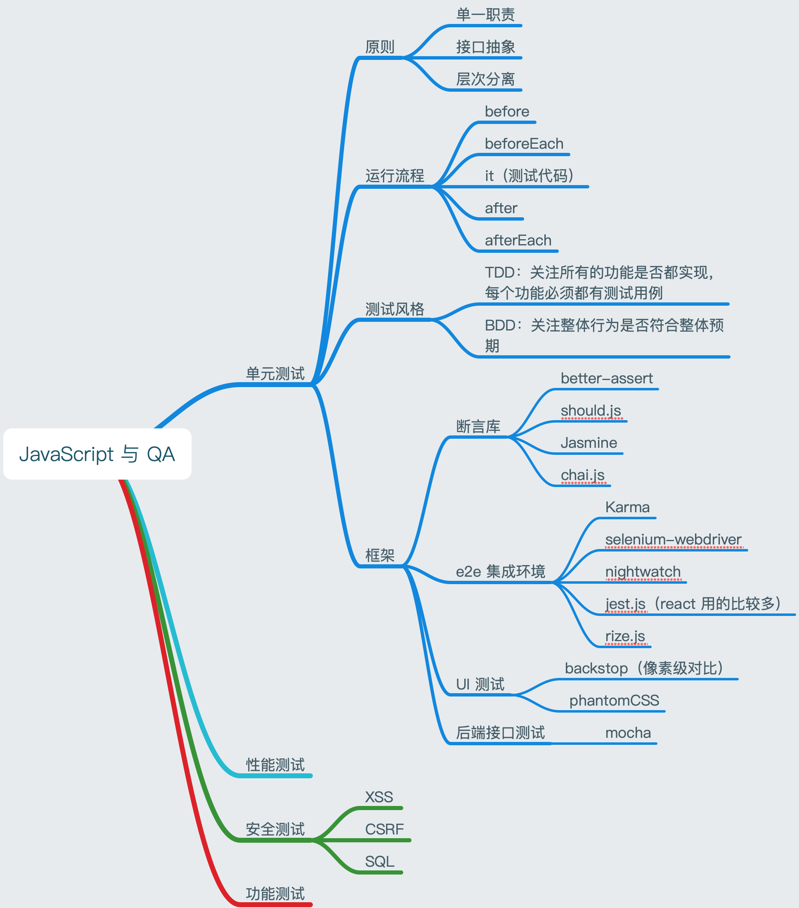

# JavaScript & QA 测试



测试方法有很多种，测试方面也有很多，主要的测试包括：单元测试，性能测试，功能测试，安全测试。

当前测试工程师分为：黑盒和白盒。

测试主要还是让代码在线上运行更加健壮，当代码在线上跑的时候让开发 QA 放心。

## 1. 单元测试

### 1.1 单元测试原理

对自己输出的东西进行测试，一般不需要 QA 工程师接入，程序员通过自己的测试脚本去完成单元测试，让自己输出的东西值得别人信赖。

目的：
能让开发者明确知道代码的结果。

原则：
单一职责，接口抽象，层次分离。（能抽离的抽离，管好自己的代码。每一个函数尽量少的代码，从一个个小功能开始抽离，将不同的小功能分离成不同的函数。）

断言库：
保证最小单元是否正常运行的检测方法。

测试风格：
测试驱动开发（TDD），行为驱动开发（BDD），均是敏捷开发的方法论。

> 敏捷开发：简单的来说其实就是 todo，doing，done

TDD：关注所有的功能是否都实现，每个功能必须都有测试用例。
断言库：`better-assert`

BDD：关注整体行为是否符合整体预期，编写的每一行代码都有目的的提供一个完整的测试用例。
断言库：`should.js`，`expect.js`，`Jasmine`（14.1Kstar）

TBB 和 BDD 结合的双模断言库：`chai.js`

**断言库的生命周期：**

before -> beforeEach -> 代码块 （it）-> after -> afterEach

### 1.2 单元测试工具

#### 1.2.1 [karma](https://karma-runner.github.io/3.0/intro/installation.html)

karma 是一个单元测试执行过程管理工具，主要是对 JS 进行单元测试，用到的断言库是`jasmine`，运行环境有很多选择，可以基于`chrome`或者无头浏览器`phantomjs`去做 js 自动化单元测试，运行环境可以在初始化`karma`的时候选择。

- 安装

安装`karma`可以直接去[karma 官网](https://karma-runner.github.io/3.0/intro/installation.html)，按照教程安装即可。

官网指示的教程是安装`chrome`去运行测试脚本，当我们使用`phantomjs`用作运行环境时，必须要安装`phantomjs`指定的依赖包。

```
npm install phantom karma-phantomjs-launcher --save-dev
```

- 初始化

初始化：`karma init`，执行初始化命令之后，会有一系列的提示选择，根据自己的喜好，选择即可，上面说的选择操作系统，就在其中。

在最后都选择完之后会生成一个`karma.conf.js`，里面是`karma`的一些配置，包括需要测试的文件`files`下，还有生成测试报表的目录`coverageReporter`（需要）。

- 编写测试脚本

初始化完成之后，我们就要编写测试脚本了，要在相应的目录下编写`*.spec.js`结尾的文件，一般的脚本命令都是以`*.spec.js`结尾。

**例：**

我们的开发代码：

```js
window.add = function(a) {
  if (a == 1) {
    return 1;
  } else {
    return a + 1;
  }
};

const test = function(str) {
  return str.split('');
};
```

我们的测试脚本：

```js
describe('测试基本函数的API', function() {
  it('+1函数应用', function() {
    expect(window.add(1)).toBe(1);
    expect(window.add(2)).toBe(3);
  });
  it('测试字符串切割', function() {
    expect(test('123')).toEqual(['1', '2', '3']);
  });
});
```

:::tip
我们如果使用了`phantomjs`用作运行环境的话，可能会因为`phantomjs`版本太老，不支持 ES6 语法，所以我们尽量使用 ES5 去编写测试脚本。
:::

- 运行脚本

在命令行中使用`karma start`即可跑 karma 的测试脚本。

- 生成测试报表

我们测试完成之后可以通过生成报表去观察测试的情况，这个时候就要使用到 [karma-coverage](https://www.npmjs.com/package/karma-coverage) 了，按照`npm`上的指导进行安装即可。

#### 1.2.2 selenium-webdriver

主要用作页面测试，需要安装 [selenium-webdriver](https://www.npmjs.com/package/selenium-webdriver) 依赖包。

- 安装

```bash
npm install selenium-webdriver
```

在安装了`selenium-webdriver`依赖包之后，还需要下载对应浏览器的依赖程序，如果要使用`Chrome`测试，那就下载`Chrome`的包，如果使用`Firefox`测试，就下载`Firefox`的包。如下图：


- 编写测试代码

npm 对应的`selenium-webdriver`依赖包中，有简单的测试脚本，我们手动创建一个`*.spec.js`，把测试脚本的代码 copy 进去。

```js
const { Builder, By, Key, until } = require('selenium-webdriver');

(async function example() {
  let driver = await new Builder().forBrowser('firefox').build();
  try {
    await driver.get('https://www.baidu.com/');
    await driver.findElement(By.id('kw')).sendKeys('石燕平', Key.RETURN);
    await driver.wait(until.titleIs('石燕平_百度搜索'), 1000);
  } finally {
    await driver.quit();
  }
})();
```

- 运行脚本

```bash
node XX/*.spec.js
```

其中 XX 就是`e2e`测试脚本对应的文件夹目录。

#### 1.2.3 [rize.js](https://rize.js.org/zh-CN/)

rize 的官网有详细的例子和说明，可以上官网具体看一下例子，很容易懂，而且操作起来也很简单。

- 安装

```bash
yarn add --dev puppeteer rize
```

:::tip
puppeteer 比较难装，一定要翻墙之后装，要不然会出问题。
:::

- 编写测试脚本

```js
const Rize = require('rize');
const rize = new Rize({ headless: false });
rize
  .goto('https://github.com/') // 访问github
  .type('input.header-search-input', 'node') // 在class名为header-search-input的input中输入“node”
  .press('Enter') // 回车
  .waitForNavigation() // 等待页面跳转
  // .assertSee('Node.js')
  .saveScreenshot('searching-node.png') // 保存截图
  .end(); // 别忘了调用 `end` 方法来退出浏览器！
```

- 运行脚本

```bash
node XX/*.spec.js
```

#### 1.2.4 其他

其他的单元测试框架还有很多，比如：nightwatch.js，[jest.js](https://jestjs.io/)（react 使用比较多），[f2etest](https://github.com/alibaba/f2etest)。

### 1.3 UI 走查

#### 1.3.1 [backstop](https://www.npmjs.com/package/backstopjs)

- 安装

```bash
npm install -g backstopjs
```

- 初始化

```bash
backstop init
```

初始化之后会生成一些`backstop`相关的文件，修改`backstop.json`，进行配置。

将 UI 的图片放到`backstop_data/bitmaps_reference`文件夹下，图片名称的话，可以先跑一下`backstop test`，会有一个报错，就是报没有指定的图片，将图片名字 copy 一下，在`backstop_data/bitmaps_reference`下创建一个即可。

将自己写的网页链接配置到`scenarios` -> `url`中。

```json
"scenarios": [
    {
      "label": "BackstopJS Homepage",
      "cookiePath": "backstop_data/engine_scripts/cookies.json",
      "url": "https://map.qq.com/m/",
    }
  ]
```

- 测试

```bash
backstop test
```

会自动输出一个报表，放到`backstop_data/html_report`下，里面有自己写的网页和 UI 图不同的地方。

#### 1.3.2 [phantomCSS](https://github.com/HuddleEng/PhantomCSS)

phantomJS 的兄弟，专门用作 UI 走查。

### 1.4 测试后端接口

[mocha](https://www.npmjs.com/package/mocha) ，主要用于测试后端接口返回的数据结构是否正常。

- 安装

```
npm install mocha --save-dev
```

- 编写测试脚本

因为我们是测试后端的接口，所以测试的前提就是一定要有后端的接口，什么接口不限制，只要是 http 接口就行。

```js
// router.spec.js
const axios = require('axios');
describe('node接口测试', function() {
  it('test接口测试', function(done) {
    axios.get('http://localhost:3000/test').then(function(res) {
      if (res.data.code == 0) {
        done();
        console.log(res.data);
      } else {
        done(new Error('错误'));
      }
    });
  });
});
```

`describe`中可以编写很多个 it，需要测试多少接口就编写多少个 it 即可。

- 运行脚本

```bash
mocha router.spec.js
```

这里运行脚本之后，会在小黑框中运行，后续会有返回结果，如果没有报错，就证明接口没问题。如果想生成报表的话，我们就需要借助其他的依赖包了。

- 生成报表

想要生成报表，我们就需要借助 [mochawesome](https://www.npmjs.com/package/mochawesome) 依赖包了，使用方法可以参考`npm`。创建一个 js，编写下面生成报表的代码。

**例：**

```js
const Mocha = require('mocha');
var mocha = new Mocha({
  reporter: 'mochawesome',
  reporterOptions: {
    reportDir: './docs/mochawesome-report'
  }
});
mocha.addFile('./service/router.spec.js');
mocha.run(errLength => {
  if (errLength == 0) {
    process.exit();
  } else {
    process.exit(1);
  }
  console.log(`出错长度：${errLength}`);
});
```

当创建好上面的 js 之后，就不能跑`router.spec.js`了，而是需要跑创建的这个 js，`node XX.js`。不管测试通过不通过，都会讲报表生成到`reportDir`指定的目录下。

## 2. 性能测试

一般也是工程师自己去测试，QA 工程师一般不会介入。尤其是在写`node.js`时，性能测试就很重要了。

## 3. 安全测试

网页上有`CSRF`，`XSS`攻击，后端还有`SQL`攻击。

## 4. 功能测试

一个功能搞定之后，要有测试的 case，也叫测试用例，根据测试用例完成功能测试。
