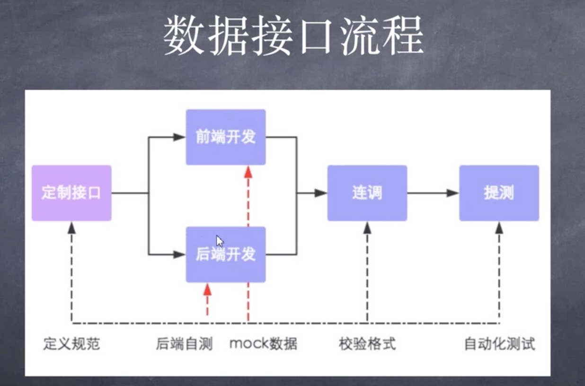

# 前后端分离

## 应用场景

- H5 游戏
- React Native 开发的移动 App
- 浏览器插件
- 微信小程序
- Electron 开发桌面应用
- 各类大型网站（复杂性业务逻辑）

## 分离的意义

- 前后端各司其职，工作各有分工

分工明确，节省了互怼时间。

- 提高开发效率

前后端在开发之前只需要定义好接口返回的数据结构，剩下的时间前后端就可以同时开发，可以节省很多开发时间。

- 完美应对需求的变化

前端页面文案会经常修改，如果不前后端分离，修改页面的同时，前后端代码都需要动，需要一起上线。但是如果分离的话，只是修改前端页面，那只需要前端去修改上线即可，后端不需要动。

- 增强代码可维护性

前后端分离后的代码，不同端的人员只需要关注自己端的代码即可，不会出现后端人员看着`html`，`css`，`js`头很大的现象。

## 如何交互

前端通过`Ajax`请求后端的接口，后端给前端返回固定的数据结构，前端将数据展示到页面上。接口的风格更多采用的是 RESTful 风格。

RESTful 协议下网络请求方式：

- get（select） - 从服务器上抽取资源
- post（create） - 在服务器上创建资源
- put（update）- 更新资源
- delete（delete）- 删除资源

实际开发中接口对接的流程：

实际开发中，首先定制接口文档；然后前端可以根据数据结构 mock 数据，后端根据数据结构开发接口并且自测；最后当两端都开发完成之后，开始联调，这样就会比较方便快捷；最后提测。

